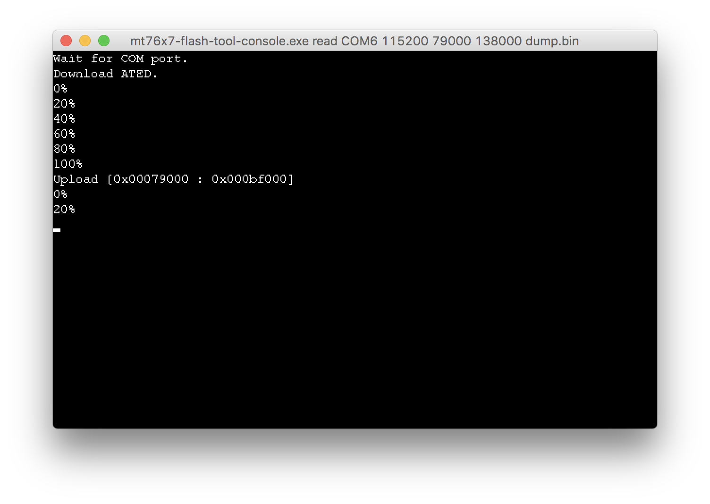

# Badge 300: Snake

There were _3_ ways to get this key:

- Beat the game with _250+_ points, which is (almost) impossible and not likely what a hacker would do.
- _Static analysis_ the ARM assembly. Could be easy for some, but not as fun as the next one.
- Modify the firmware, patch it and flash it back! (And that's what we gonna do here.)
    - This can be done solely on either Linux, macOS or Windows.
    - Can be as quick as a 10-minute-job.

## Firmware Dump

By googling with keyword "_MT7697_" (given by the badge's description), we can find some useful tools and info from its official website:

- Flash Tool (for Windows and Linux): https://docs.labs.mediatek.com/resource/mt7687-mt7697/en/downloads#Downloads-Tools
- Firmware Physical Address Info: https://docs.labs.mediatek.com/resource/mt7687-mt7697/en/get-started-linkit-7697-hdk/gcc-arm-embedded-linkit-7697/download-project-binary-with-flash-tool-linkit-7697

> Please note that these tools were under MediaTek SLA.

To enter the hardware bootloader mode, hold both `RST` and `USR` key, then release the `RST` while keep holding the `USR`. (This was mentioned in the second link above.) We can then use the above tools to dump the firmware, which is located between `0x79000` and `0x138000`. To dump the firmware, use the following command: (GUI version only supports whole flash readback, so we have to use the CLI version.)
- Windows: `mt76x7-flash-tool-console.exe read COM7 921600 79000 138000 dump.bin`
- Linux: `mt76x7-flash-tool read COM7 921600 79000 138000 dump.bin`
- macOS: As I'm a die-hard macOS user, here's how you can do the above on macOS with the help of __wine__.
    - Install __USB to UART driver__: https://www.silabs.com/products/development-tools/software/usb-to-uart-bridge-vcp-drivers
    - Install wine here (Choose __Stable__ if you have no idea): https://dl.winehq.org/wine-builds/macosx/download.html
    - Symbolic USB to COM port for wine (here we choose _COM6_): `ln -s /dev/cu.SLAB_USBtoUART ~/.wine/dosdevices/COM6`
    - Install VC++ runtime (I have no idea if we need this, just to be save.): `wine vcredist_x86_vs2010.exe` & `wine vcredist_x64_vs2010.exe`
    - Do as Windows does it with __wineconsole__ (I use `115200` instead of `921600` for the stability.): `wineconsole mt76x7-flash-tool-console.exe read COM6 115200 79000 138000 dump.bin`
    

Result:

    Wait for COM port.
    Switch high speed.
    0%
    100%
    Download ATED.
    0%
    20%
    40%
    60%
    80%
    100%
    Upload [0x00079000 : 0x000bf000]
    0%
    20%
    40%
    60%
    80%
    100%
    [OK].

We now have the firmware dump as `dump.bin`.

## Disassemble Firmware

Personally I prefer lightweight free tools. The MT7697 chip is based on ARM __Cortex-M4__ processor. We can use `objdump` as a disassembler.

_* IDA Pro also supports Cortex-M4._

> Note:
> - For macOS, you will have to install `binutils` (via Homebrew: `brew install binutils`), then use `gobjdump`.
> - There're also Windows versions available, google for it.

Here's how it's done:

    objdump -D -b binary -m arm -M force-thumb dump.bin > dump.S                        // Now we have the assembly.
    cat dump.S | grep 0xf9 | grep cmp > result.S                                        // Looking for '249', which is given by the badge description.
    cat result.S                                                                        // Only one hit! We got lucky! :p

    > 13e2:	2cf9      	cmp	r4, #249	; 0xf9

So we have the location to patch. Please note that in the actual binary, the data was flipped (as `F9 2C`). To patch `F9`, the offset should be `0x13e2` instead of `0x13e3`.

    cp dump.bin dump_mod.bin                                                            // Make a duplicate for editing.
    printf '\x01' | dd of=dump_mod.bin bs=1 seek=5090 count=1 conv=notrunc              // Offset 0x13e2 (hex) == 5090 (dec), let's change it to 1.
    objdump -D -b binary -m arm -M force-thumb dump_mod.bin | grep '13e2' | grep cmp   // Re-check the result. looks OK!

    > 13e2:	2c01      	cmp	r4, #1

And we have the modified `dump_mod.bin`.

> The reason we choose `1` was because we can't be sure if the game checked against `0` before this `cmp`. Make it easier enough to get the key is all we need, the value doesn't really matter.

## Flash the Modified Firmware

You can use the flash tools where we dumpped the firmware above to do the re-flashing.

However, as non of them support macOS, I decided to use Python to solve this problem:

- Get the lastest flash tool here: https://github.com/MediaTek-Labs/Arduino-Add-On-for-LinkIt-SDK/releases/latest
- Command: `python upload.py -p mt7697 -c /dev/cu.SLAB_USBtoUART -f dump_mod.bin`

Result:

    Start uploading the download agent
    0%                          100%
    [##############################] | ETA: 00:00:00
    Total time elapsed: 00:00:03
    DA uploaded, start uploading the user bin
    0%                          100%
    [##############################] | ETA: 00:00:00
    Total time elapsed: 00:00:16
    Bin file uploaded. The board reboots now.

Now go play the _Snake_ game, get 2+ points then suicide to check the score. You will get the hidden static key: `86454e01`.
